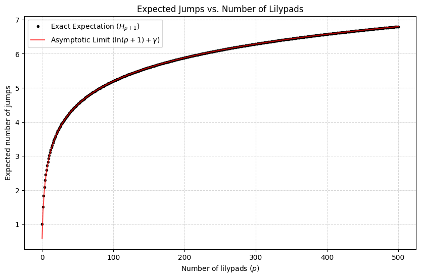

# The Frog Problem
<a href="https://colab.research.google.com/github/brayvid/frog-problem/blob/master/frog_problem.ipynb" rel="Open in Colab"></a>

#### Presented by Timandra Harkness and Matt Parker in [*Can you solve The Frog Problem?*](https://www.youtube.com/watch?v=ZLTyX4zL2Fc)

### Statement

Imagine some number of lilypads spanning a river in a line, and a frog at one bank. The frog wants to cross the river. To move forward, it selects one of the lilypads with uniform probability (or the far bank, which we include as an option), hops there, selects a new position closer to its destination, and repeats this process until it eventually reaches the far side.

<strong>*For a given number of lilypads $p$, what is the expected number of jumps for the frog to make it across the river?*</strong>

### Mathematical Formulation

#### Expected Number of Jumps

Let $E_n$ be the expected jumps to reach the destination from $n$ steps away. Since the frog lands at any remaining distance $i < n$ with uniform probability $\frac{1}{n}$, we establish the recurrence:
$$E_n = 1 + \frac{1}{n} \sum_{i=0}^{n-1} E_i \quad \text{with } E_0 = 0$$

Multiplying by $n$ gives $n E_n = n + \sum_{i=0}^{n-1} E_i$. Subtracting the equation for $n-1$ isolates the transition step:
$$n E_n - (n-1) E_{n-1} = 1 + E_{n-1} \implies E_n - E_{n-1} = \frac{1}{n}$$

This telescopes directly to the $n$-th Harmonic number, $H_n$:
$$E_n = H_n = \sum_{r=1}^{n} \frac{1}{r}$$

For a river with $p$ lilypads, the total distance to cover is $p+1$ steps. Therefore, the expected number of jumps is:
$$E(\text{steps}) = H_{p+1} = \sum_{r=1}^{p+1} \frac{1}{r}$$

For large values of $p$, this expectation can be approximated using the natural logarithm:
$$H_{p+1} \approx \ln(p+1) + \gamma$$
where $\gamma \approx 0.57721$ is the Euler-Mascheroni constant.

#### Probability Distribution of Jump Counts

Let $G_n(x) = \sum_{k=0}^{n} P(K=k) x^k$ be the Probability Generating Function (PGF) for the steps to cover distance $n$. 

Because a jump from distance $n$ lands at distance $j < n$ with probability $\frac{1}{n}$ and costs $1$ step, the relation is:
$$G_n(x) = \frac{x}{n} \sum_{j=0}^{n-1} G_j(x) \quad \text{with } G_0(x) = 1$$

Subtracting the relation for $n-1$ simplifies the recurrence to:
$$G_n(x) = G_{n-1}(x) \left( \frac{1}{n}x + \frac{n-1}{n} \right)$$

Applying this inductively over the total distance $p+1$ yields the product:
$$G_{p+1}(x) = \prod_{i=1}^{p+1} \left( \frac{1}{i}x + \frac{i-1}{i} \right)$$

The probability of taking exactly $k$ jumps is the coefficient of $x^k$ in this product, which corresponds to the normalized unsigned Stirling numbers of the first kind:
$$P(K = k) = \frac{\left[ \begin{matrix} p+1 \\ k \end{matrix} \right]}{(p+1)!}$$

We obtain these coefficients computationally by convolving the linear term coefficient vectors $\left[\frac{1}{i}, \frac{i-1}{i}\right]$ for $i = 1, \dots, p+1$.

---

### Solution

The code in this notebook uses functions from the [``numpy``](https://docs.scipy.org/doc/numpy/) and [``matplotlib``](https://matplotlib.org/3.1.1/api/_as_gen/matplotlib.pyplot.html#module-matplotlib.pyplot) modules.

```python
import numpy as np # vectorized math operations
from matplotlib import pyplot as pl # plots points
```

#### Compute the Probability Distribution

To compute the probability of taking exactly $k$ steps, we expand the PGF polynomial $G_{p+1}(x)$ by sequentially convolving the probability vectors of each linear factor. This replaces combinatorial path enumeration with an efficient $O(p^2)$ algorithm.

```python
def lengthProbDistribution(p):
    """
    Computes the probability of taking k steps for all k in [1, p+1].
    Returns a numpy array of probabilities where index i corresponds to k = i + 1.
    """
    poly = np.array([1.0])
    for i in range(1, p + 2):
        poly = np.convolve(poly, [1.0 / i, (i - 1.0) / i])
    return poly[::-1][1:]

def lengthProb(p, k):
    """
    Returns the probability of taking exactly k steps with p lilypads.
    """
    if k < 1 or k > p + 1:
        return 0.0
    dist = lengthProbDistribution(p)
    return dist[k - 1]
```

#### Compute the Expected Number of Steps

The expectation is calculated directly in $O(p)$ time using the Harmonic sum $H_{p+1}$, bypassing the need to generate path lists or compute the full probability distribution.

```python
def expectedSteps(p):
    """
    Returns the expected number of steps for p lilypads.
    """
    return np.sum(1.0 / np.arange(1, p + 2))
```

### Examples

#### Find the probability that $k=1$ given $p=4$

```python
lengthProb(4, 1)
```

    0.2

#### Show that the total probability of all routes is $1$ for $p=5$

```python
p = 5
dist = lengthProbDistribution(p)
print(np.sum(dist))
```

    1.0

#### Find the expected number of steps for $p=1$

```python
expectedSteps(1)
```

    1.5

#### Plot the expected steps for several $p$

Because the calculations are mathematically optimized, we can plot the expected values across a larger range of $p$ to visualize the logarithmic curve.

```python
# Values of p to check
lowP = 0
highP = 500

# Plot points
x = range(lowP, highP + 1)
y = [expectedSteps(p) for p in x]

pl.figure(figsize=(10, 6))
pl.plot(x, y, 'ko', markersize=4)
pl.xlabel('Number of lilypads')
pl.ylabel('Expected number of jumps')
pl.title('Expected Jumps vs. Number of Lilypads')
pl.grid(True, linestyle='--', alpha=0.5)
pl.show()
```



----

<p align="center">&copy; Copyright 2026 <a href="https://blakerayvid.com">Blake Rayvid</a>. All rights reserved.</p>